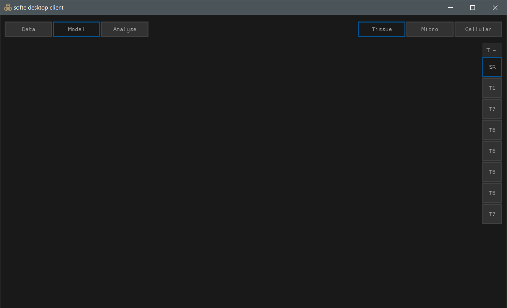

## softe desktop client
[](http://github.com/badges/stability-badges)

This client is inetended to serve as a ```'testbed'``` for distributed compute and graphics pipelines for 3d-applications. It is mainly targeted for the evaluation of the below features/paradigms (not all are yet implemented):
1. Single-host-multiple-device architecture.
2. Vulkan graphics backend with parallel command buffer creation, multistage rendering pipeline and offscreen rendering.
3. OpenCL compute backend with kernel-execution-graph.
4. Hybrid application with local and distributed services.
5. Evaluation of C++/Python APIs of cloud infrastructures and serverless-services (AWS, Paperspace, etc.).
6. Visualizing and debugging distributed services.

#
### Below are the descriptions of the various components:
```sh
WORKSPACE
|
|----windowsapp
|       |----windowsapp.cpp     "application entry: provides Window"
|
|----thirdparty                 "small external dependencies
|                                copied in this repo"
|----source
|       |----uxmanager
|       |----scripting
|       |----devicemanager      ".dll with implicit load-time linking,
|       |                        provides the compute and graphics pipeline."
|       |
|       |----services           "stubs and client code for the services."
|
|----README.md                  "repo description."
```
The ```devicemanager``` library provides both the compute and graphics pipeline. Refer to the graphics and compute [docs](source/devicemanager/README.md) for details regarding how to setup the pipelines.

#
### Dependencies and build details:
Currently, the client is only implemented for windows and uses Visual Studio as the build system. The application code has no dependency of windows-os except for the parent Window.
1. Get the repositoy:
```sh
git clone https://github.com/automatos-studios/softe-desktop-client.git
```
2. Setup these environment variables:
```sh
'SOFTE_CLIENT_BOOST_DIR'
e.g. {your_thirdparty_repos}/boost/boost_1_67_0

'SOFTE_CLIENT_OPENCL_SDK'
e.g.{path to NVIDIA GPU Toolkit}/CUDA/v9.1

'SOFTE_CLIENT_PYTHON_SDK'
e.g. {your_thirdparty_repos}/python/Python36_64

'SOFTE_CLIENT_THIRDPARTY'
e.g. {this repo root}/thirdparty

'SOFTE_CLIENT_VULKAN_SDK'
e.g. {your system installations}/VulkanSDK/1.0.65.1
```
NOTE: Your system should have the OpenCL SDK, Vulkan Lunar SDK, and Boost-Signal headers ([TODO: add links in thirdparty]).

3. Open the Visual Studio solution in the ```'.../repo-root/windowsapp'``` folder. It has two projects the ```windowsapp``` client which references the ```devicemanager``` library. Building the ```windowsapp``` client will build the library as well.


#

### References
* nvidia developer blog [Vulkan Memory Management](https://developer.nvidia.com/vulkan-memory-management).

#

### Application Mockup 
MODES: [Data, Model, Analyze]. SCALE: [Tissue, Micro, Cellular]. TOOLS: [SR, T1, ...]



### External Dependencies provided in the thirdparty folder:
* [nuklear](https://github.com/vurtun/nuklear)
* [stb](https://github.com/nothings/stb#stb_libs)
* [vma](https://github.com/GPUOpen-LibrariesAndSDKs/VulkanMemoryAllocator)